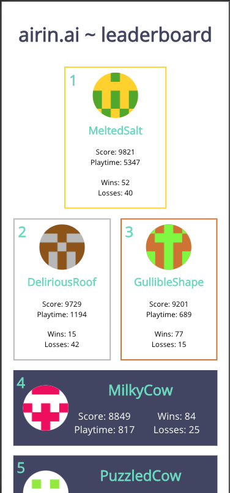
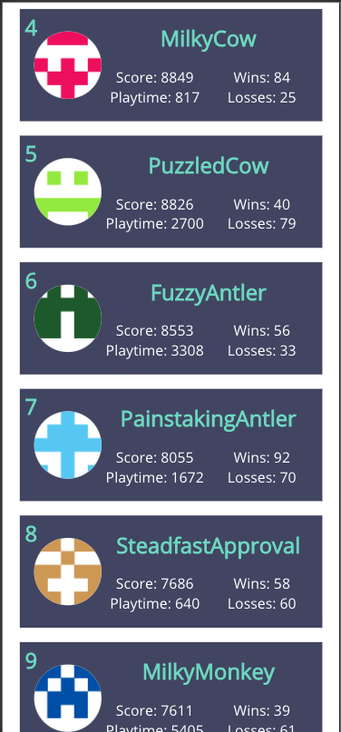
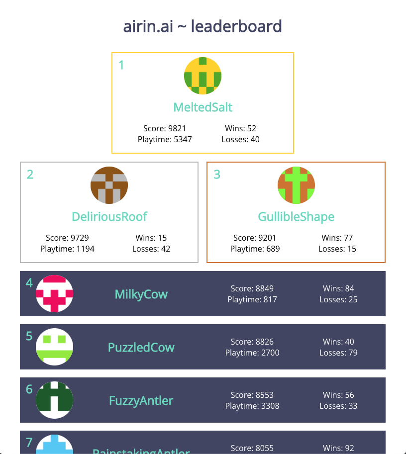

# airin.ai leaderboard challenge

## Built by
- Andrew Durrant

## Clone the repo

- In your CLI, cd into the desired folder, then run: 
```
https://github.com/AndrewDurrant/Airin_Leaderboard_Challenge.git
```
You should see something like this:

```
Cloning into 'Airin_Leaderboard_Challenge'...
remote: Enumerating objects: 322, done.
remote: Counting objects: 100% (322/322), done.
remote: Compressing objects: 100% (225/225), done.
remote: Total 26681 (delta 164), reused 194 (delta 85), pack-reused 26359
Receiving objects: 100% (26681/26681), 97.42 MiB | 18.50 MiB/s, done.
Resolving deltas: 100% (10880/10880), done.
...
```
## Install dependencies

- CD into the repo you just cloned and run the following command:

```bash
npm install
# or
yarn install
```

This will install all the required dependencies to make the project run.
You should see something like this:
```

...added 1660 packages from 713 contributors and audited 1669 packages in 39.11s

68 packages are looking for funding
  run `npm fund` for details

found 4 vulnerabilities (3 low, 1 high)
  run `npm audit fix` to fix them, or `npm audit` for details
```

## Run Application
```
npm start
```
This will open a window in your default browser at:
http://localhost:3000

### Test application
```
npm test
```
All tests should be passing

## Links
- Figma wire frame: 
https://www.figma.com/file/ZUcDgnrLUutlJAeS0d6K9Z/Airin-Leaderboard-Wireframe?node-id=0%3A1

- Live App:
https://andrewdurrant.github.io/Airin_Leaderboard_Challenge/

- Github Repo:
https://github.com/AndrewDurrant/Airin_Leaderboard_Challenge

## Explanation of Tech Utilized
- Frontend
  * React
  * CSS Grid
  * CSS Flexbox
- Testing
  * Jest

I kept this app pretty simple and did not bring in some of my favorite JS and CSS tools: Sass and React Bootstrap. They felt like overkill for this challenge.

I went with the React framework since this is the JavaScript framework I am most familiar with.

I utilized Grid and Flexbox for a modern CSS design layout.

This is a *MOBILE-FIRST* design (built using iPhone X screen size)

## Screen Shots:
<br />
<br /> 
<br /> 
<br /> 
